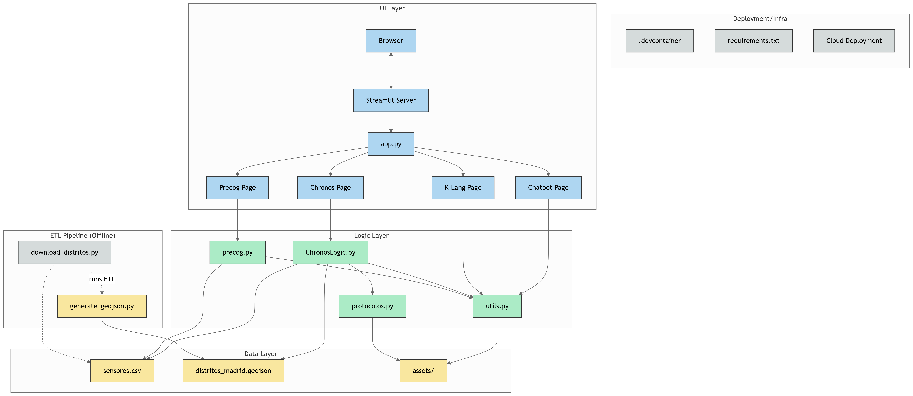

# Dashboard de Mando y Control - ChronoLogistics

Repositorio: [https://github.com/jhackisneros/dashboard_de_mando.git](https://github.com/jhackisneros/dashboard_de_mando.git)

---

## Descripción

Este proyecto implementa un dashboard integral para la gestión táctica y estratégica de crisis, desarrollado por ChronoLogistics. El sistema está dividido en módulos independientes que cubren monitorización de riesgos, visión estratégica y protocolos de actuación, integrados en una interfaz Streamlit.

---

## Estructura del Proyecto

El proyecto está organizado en capas y módulos, como muestra el siguiente diagrama:



- **UI Layer:**  
  - `app.py` (o `run.py`): punto de entrada principal.
  - Páginas: Precog, Chronos, K-Lang, Chatbot.

- **Logic Layer:**  
  - `precog.py`, `ChronosLogic.py`, `protocolos.py`, `utils.py`: lógica de negocio y procesamiento.

- **Data Layer:**  
  - `sensores.csv`, `distritos_madrid.geojson`, `assets/`: datos y recursos.

- **ETL Pipeline:**  
  - `download_distritos.py`, `generate_geojson.py`: scripts para preparar los datos.

- **Infraestructura:**  
  - `.devcontainer/`, `requirements.txt`, despliegue en la nube.

---

## Instalación y Puesta en Marcha

### 1. Requisitos Previos

- Python 3.8 o superior
- Git

### 2. Instalación de Dependencias

Se recomienda usar un entorno virtual:

```bash
python -m venv venv
# En Windows:
venv\Scripts\activate
# En Mac/Linux:
source venv/bin/activate
pip install -r requirements.txt
```

Dependencias principales:
- streamlit
- numpy, pandas
- matplotlib, seaborn
- Pillow
- scikit-learn

### 3. Ejecución Local

```bash
streamlit run run.py
```

Esto lanzará el dashboard en tu navegador.

---

## Solución de Problemas

- **Dependencias:**  
  Asegúrate de instalar todas las dependencias:
  ```bash
  pip install -r requirements.txt
  ```

- **Entorno virtual:**  
  Actívalo antes de ejecutar cualquier comando.

- **Errores en la terminal:**  
  Lee el mensaje y consulta con el equipo si no puedes resolverlo.

- **Python >= 3.8:**  
  Verifica con `python --version`.

---

## Visualizaciones Avanzadas

Para mapas de calor 3D, instala plotly:

```bash
pip install plotly
```

Ejemplo de uso en Streamlit:
```python
import plotly.graph_objects as go
import streamlit as st

fig = go.Figure(data=[go.Surface(z=[[1,2],[3,4]])])
st.plotly_chart(fig)
```

---

## Despliegue

- **Streamlit Community Cloud**  
- **Hugging Face Spaces**  
  - El archivo principal debe llamarse `main.py`.
  - Incluye `requirements.txt` con todas las dependencias.

---

## Buenas Prácticas

- Usa control de versiones (Git).
- Documenta funciones y módulos.
- Mantén el código modular y reutilizable.
- Realiza pruebas unitarias.
- Haz revisiones de código antes de hacer merge.

---

## Colaboración

- Sincroniza cambios diariamente.
- Usa issues y pull requests.
- Mantén comunicación constante entre equipos.

---

## Contacto

Para dudas técnicas, contacta al CTO o al responsable de cada módulo.

---

Este proyecto es crítico para la respuesta a crisis de ChronoLogistics. La calidad y robustez del código es prioritaria.